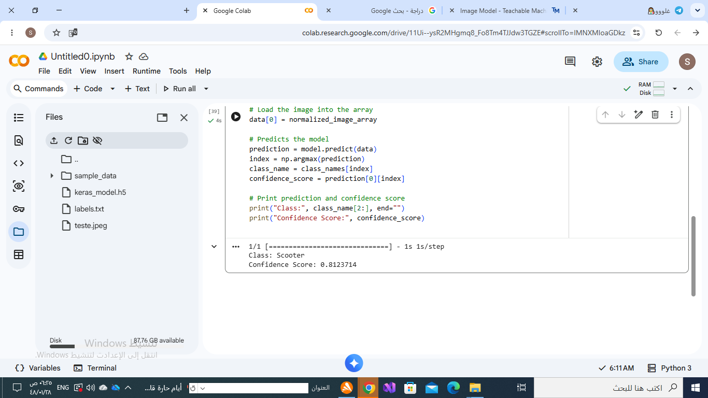

# AI Bike and Scooter Classifier

## Description
This project uses Google Teachable Machine to build an AI model that classifies images as either a bicycle or a scooter.

## Features
- Image classification using AI
- Trained with Google Teachable Machine
- Predicts whether the image is a bicycle or a scooter

## Technologies Used
- Google Teachable Machine
- Python
- TensorFlow / Keras

## Files
- Trained AI model (.h5)
- Labels file
- Python prediction script
- Sample images
- Prediction result image

## Project Goal
To build and test an AI image classification model that can distinguish between bicycles and scooters.

## chable_maching

  
## Results

## Author
Sara Saud Alotaibi
